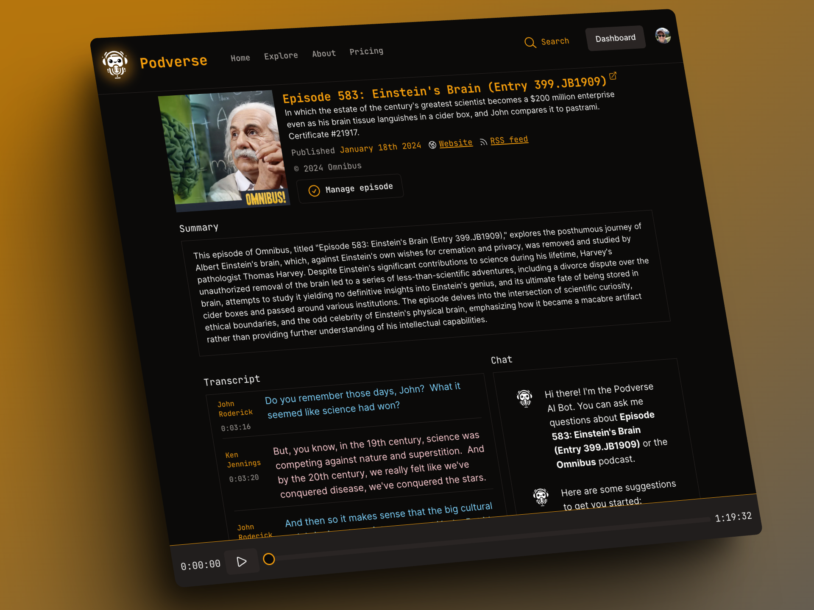

# Podverse - AI Superpowers for Podcasts



Podverse is a web app that brings AI superpowers to podcasts.
Check out the live site at [https://podverse.ai](https://podverse.ai)!

This project is meant as a demonstration of a full-stack webapp that leverages AI capabilities.

## Features

* Import a podcast by providing its RSS feed URL
* Automatic transcript generation using [Deepgram](https://deepgram.com) 
* Automatic AI-generated diarization and speaker identification
* Automatic AI-generated episode summaries
* LLM-powered chatbot with RAG
* Full-text search against podcast transcripts, metadata, and summaries

## Architecture

Podverse is an entirely serverless architecture. It is built using Next.js and can be deployed
using [Vercel](https://vercel.com). It uses [TailwindCSS](https://tailwindcss.com/) for styling
and [ShadCN](https://ui.shadcn.com/) for UI components.

It uses the following services:
* [Supabase](https://supabase.com) as the back-end database
* [Clerk](https://clerk.com) for authentication
* [Inngest](https://inngest.com) for background data processing
* [Deepgram](https://deepgram.com) for transcript generation
* [OpenAI](https://openai.com) models for LLMs
* [Stripe](https://stripe.com) for billing
* [Mailgun](https://mailgun.com) for sending emails

## Installation

1. Ensure you have `npm` and `yarn` installed.
1. Clone this repo
1. Run: `yarn` to install all package dependencies

## Environment setup

These instructions assume you will be deploying to Vercel. This is not strictly necessary
but will simplify configuration.

1. Create a Vercel project for your deployment.
1. Add the **Supabase** and **Inngest** integrations to your Vercel project. This should add the
various environment variables needed for Supabase, Inngest, and Postgres.
1. Create an [OpenAI](https://openai.com) API key and add it as the environment variable
`OPENAI_API_KEY` in your Vercel project's environment variables.
1. Create a [Deepgram](https://deepgram.com) API key and add it as the environment variable
`DEEPGRAM_API_KEY` in your Vercel project's environment variables. Also add the key identifier
as `DEEPGRAM_API_KEY_IDENTIFIER`.
1. Create a [Clerk](https://clerk.com) API key and add the environment variables
`CLERK_SECRET_KEY` and `NEXT_PUBLIC_CLERK_PUBLISHABLE_KEY` to your Vercel project.
1. Create a [Mailgun](https://mailgun.com) API key and add the environment variables
`MAILGUN_DOMAIN` and `MAILGUN_API_KEY` to your Vercel project.

Optionally, if you want to enable billing, you can set up a [Stripe](https://stripe.com)
account, and set the environment variables `NEXT_PUBLIC_STRIPE_PUBLISHABLE_KEY`,
`STRIPE_SECRET_KEY`, and `STRIPE_WEBHOOK_SECRET`.

## Supabase setup

The file `supabase-schema.sql` contains a dump of the Supabase schema for Podverse,
generated using `supabase db dump`. Once you have initialized your Supabase project,
you can restore it using:

```
$ psql -h YOUR_SUPABASE_DB_HOST -U YOUR_DB_USER -d YOUR_DB_NAME -f supabase-schema.sql
```

## Local development

For local development, you will need to create the file `packages/webapp/.env.local`
containing the following values.

```
SUPABASE_URL=<Supabase URL>
SUPABASE_API_KEY=<Supabase API key>
SUPABASE_SERVICE_ROLE_KEY=<Supabase service role key>
NEXT_PUBLIC_SUPABASE_URL=<Supabase URL>
NEXT_PUBLIC_SUPABASE_ANON_KEY=<Supabase anon key>

DEEPGRAM_API_KEY=<Deepgram API key>
DEEPGRAM_API_KEY_IDENTIFIER=<Deepgram API key identifier>

INNGEST_EVENT_KEY=<Inngest event key>
INNGEST_SIGN_KEY=<Inngest sign key>

OPENAI_API_KEY=<OpenAI key>

STRIPE_SECRET_KEY=<Stripe secret key>
NEXT_PUBLIC_STRIPE_PUBLISHABLE_KEY=<Stripe publishable key>

CLERK_SECRET_KEY=<Clerk secret key>
NEXT_PUBLIC_CLERK_PUBLISHABLE_KEY=<Clerk publishable key>
```

You can run the service locally using:

```
$ yarn workspace webapp dev
```

Note that background processing tasks (e.g., ingesting a new podcast) are executed using
[Inngest](https://inngest.com). For this to work locally, you need to run the
[Inngest dev server](https://www.inngest.com/docs/dev-server) locally as well, which
can be done with:

```
$ npx inngest-cli@latest dev
```

## Help, support, and questions

Please [file an issue](https://github.com/mdwelsh/podverse/issues) if you have any problems
or need help!
